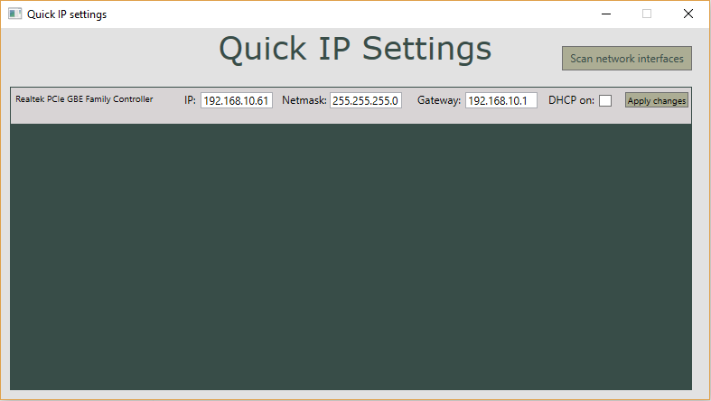

<html>
<h1>Quick IP Settings</h1>

Quick IP settings is a small application making it effortless to quickly manage IP settings for several network interfaces. The network interfaces are scanned and listed automatically.

The application allows switching between static and dynamic IP (DHCP) and changing the subnet mask and default gateway.

Administrative rights are required to run the application so that the changes in the IP settings take effect.

A very helpful part of the code (VisualTreeHelpers) was originally created by Rachel Lim and was found <a href="https://rachel53461.wordpress.com/2011/10/09/navigating-wpfs-visual-tree/">here</a>.

<h3>Created with .NET framework and WPF.</h3>

</html>